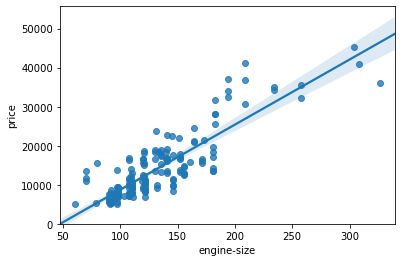
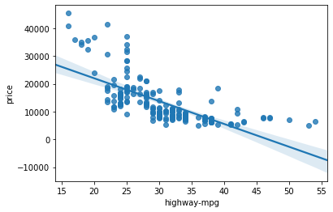
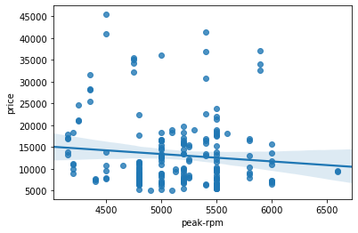
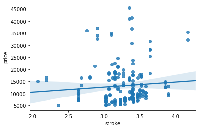
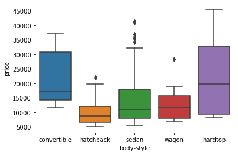
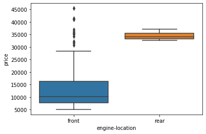
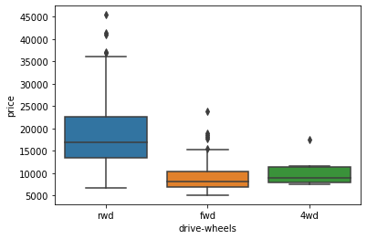
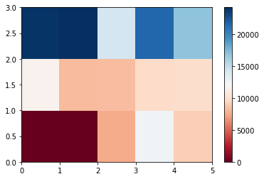
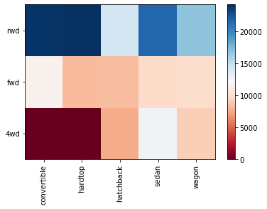

<div class="alert alert-block alert-info" style="margin-top: 20px">
    <a href="https://cocl.us/corsera_da0101en_notebook_top">
         
    </a>
</div>


<a href="https://www.bigdatauniversity.com"></a>

<h1 align=center><font size = 5>Data Analysis with Python</font></h1>

Exploratory Data Analysis

<h3>Welcome!</h3>
In this section, we will explore several methods to see if certain characteristics or features can be used to predict car price. 

<h2>Table of content</h2>

<div class="alert alert-block alert-info" style="margin-top: 20px">
<ol>
    <li><a href="#import_data">Import Data from Module</a></li>
    <li><a href="#pattern_visualization">Analyzing Individual Feature Patterns using Visualization</a></li>
    <li><a href="#discriptive_statistics">Descriptive Statistical Analysis</a></li>
    <li><a href="#basic_grouping">Basics of Grouping</a></li>
    <li><a href="#correlation_causation">Correlation and Causation</a></li>
    <li><a href="#anova">ANOVA</a></li>
</ol>
    
Estimated Time Needed: <strong>30 min</strong>
</div>
 
<hr>

<h3>What are the main characteristics which have the most impact on the car price?</h3>

<h2 id="import_data">1. Import Data from Module 2</h2>

<h4>Setup</h4>

 Import libraries 


```python
import pandas as pd
import numpy as np
```

 load data and store in dataframe df:

This dataset was hosted on IBM Cloud object click <a href="https://cocl.us/DA101EN_object_storage">HERE</a> for free storage


```python
path='https://s3-api.us-geo.objectstorage.softlayer.net/cf-courses-data/CognitiveClass/DA0101EN/automobileEDA.csv'
df = pd.read_csv(path)
df.head()
```


<div>
<style scoped>
    .dataframe tbody tr th:only-of-type {
        vertical-align: middle;
    }

    .dataframe tbody tr th {
        vertical-align: top;
    }

    .dataframe thead th {
        text-align: right;
    }
</style>
<table border="1" class="dataframe">
  <thead>
    <tr style="text-align: right;">
      <th></th>
      <th>symboling</th>
      <th>normalized-losses</th>
      <th>make</th>
      <th>aspiration</th>
      <th>num-of-doors</th>
      <th>body-style</th>
      <th>drive-wheels</th>
      <th>engine-location</th>
      <th>wheel-base</th>
      <th>length</th>
      <th>...</th>
      <th>compression-ratio</th>
      <th>horsepower</th>
      <th>peak-rpm</th>
      <th>city-mpg</th>
      <th>highway-mpg</th>
      <th>price</th>
      <th>city-L/100km</th>
      <th>horsepower-binned</th>
      <th>diesel</th>
      <th>gas</th>
    </tr>
  </thead>
  <tbody>
    <tr>
      <th>0</th>
      <td>3</td>
      <td>122</td>
      <td>alfa-romero</td>
      <td>std</td>
      <td>two</td>
      <td>convertible</td>
      <td>rwd</td>
      <td>front</td>
      <td>88.6</td>
      <td>0.811148</td>
      <td>...</td>
      <td>9.0</td>
      <td>111.0</td>
      <td>5000.0</td>
      <td>21</td>
      <td>27</td>
      <td>13495.0</td>
      <td>11.190476</td>
      <td>Medium</td>
      <td>0</td>
      <td>1</td>
    </tr>
    <tr>
      <th>1</th>
      <td>3</td>
      <td>122</td>
      <td>alfa-romero</td>
      <td>std</td>
      <td>two</td>
      <td>convertible</td>
      <td>rwd</td>
      <td>front</td>
      <td>88.6</td>
      <td>0.811148</td>
      <td>...</td>
      <td>9.0</td>
      <td>111.0</td>
      <td>5000.0</td>
      <td>21</td>
      <td>27</td>
      <td>16500.0</td>
      <td>11.190476</td>
      <td>Medium</td>
      <td>0</td>
      <td>1</td>
    </tr>
    <tr>
      <th>2</th>
      <td>1</td>
      <td>122</td>
      <td>alfa-romero</td>
      <td>std</td>
      <td>two</td>
      <td>hatchback</td>
      <td>rwd</td>
      <td>front</td>
      <td>94.5</td>
      <td>0.822681</td>
      <td>...</td>
      <td>9.0</td>
      <td>154.0</td>
      <td>5000.0</td>
      <td>19</td>
      <td>26</td>
      <td>16500.0</td>
      <td>12.368421</td>
      <td>Medium</td>
      <td>0</td>
      <td>1</td>
    </tr>
    <tr>
      <th>3</th>
      <td>2</td>
      <td>164</td>
      <td>audi</td>
      <td>std</td>
      <td>four</td>
      <td>sedan</td>
      <td>fwd</td>
      <td>front</td>
      <td>99.8</td>
      <td>0.848630</td>
      <td>...</td>
      <td>10.0</td>
      <td>102.0</td>
      <td>5500.0</td>
      <td>24</td>
      <td>30</td>
      <td>13950.0</td>
      <td>9.791667</td>
      <td>Medium</td>
      <td>0</td>
      <td>1</td>
    </tr>
    <tr>
      <th>4</th>
      <td>2</td>
      <td>164</td>
      <td>audi</td>
      <td>std</td>
      <td>four</td>
      <td>sedan</td>
      <td>4wd</td>
      <td>front</td>
      <td>99.4</td>
      <td>0.848630</td>
      <td>...</td>
      <td>8.0</td>
      <td>115.0</td>
      <td>5500.0</td>
      <td>18</td>
      <td>22</td>
      <td>17450.0</td>
      <td>13.055556</td>
      <td>Medium</td>
      <td>0</td>
      <td>1</td>
    </tr>
  </tbody>
</table>
<p>5 rows × 29 columns</p>
</div>


<h2 id="pattern_visualization">2. Analyzing Individual Feature Patterns using Visualization</h2>

To install seaborn we use the pip which is the python package manager.


```python
%%capture
! pip install seaborn
```

 Import visualization packages "Matplotlib" and "Seaborn", don't forget about "%matplotlib inline" to plot in a Jupyter notebook.


```python
import matplotlib.pyplot as plt
import seaborn as sns
%matplotlib inline 
```

<h4>How to choose the right visualization method?</h4>
<p>When visualizing individual variables, it is important to first understand what type of variable you are dealing with. This will help us find the right visualization method for that variable.</p>


```python
# list the data types for each column
print(df.dtypes)
```

    symboling              int64
    normalized-losses      int64
    make                  object
    aspiration            object
    num-of-doors          object
    body-style            object
    drive-wheels          object
    engine-location       object
    wheel-base           float64
    length               float64
    width                float64
    height               float64
    curb-weight            int64
    engine-type           object
    num-of-cylinders      object
    engine-size            int64
    fuel-system           object
    bore                 float64
    stroke               float64
    compression-ratio    float64
    horsepower           float64
    peak-rpm             float64
    city-mpg               int64
    highway-mpg            int64
    price                float64
    city-L/100km         float64
    horsepower-binned     object
    diesel                 int64
    gas                    int64
    dtype: object


<div class="alert alert-danger alertdanger" style="margin-top: 20px">
<h3>Question  #1:</h3>

<b>What is the data type of the column "peak-rpm"? </b>
</div>

Double-click <b>here</b> for the solution.

<!-- The answer is below:

float64

-->

for example, we can calculate the correlation between variables  of type "int64" or "float64" using the method "corr":


```python
df.corr()
```


<div>
<style scoped>
    .dataframe tbody tr th:only-of-type {
        vertical-align: middle;
    }

    .dataframe tbody tr th {
        vertical-align: top;
    }

    .dataframe thead th {
        text-align: right;
    }
</style>
<table border="1" class="dataframe">
  <thead>
    <tr style="text-align: right;">
      <th></th>
      <th>symboling</th>
      <th>normalized-losses</th>
      <th>wheel-base</th>
      <th>length</th>
      <th>width</th>
      <th>height</th>
      <th>curb-weight</th>
      <th>engine-size</th>
      <th>bore</th>
      <th>stroke</th>
      <th>compression-ratio</th>
      <th>horsepower</th>
      <th>peak-rpm</th>
      <th>city-mpg</th>
      <th>highway-mpg</th>
      <th>price</th>
      <th>city-L/100km</th>
      <th>diesel</th>
      <th>gas</th>
    </tr>
  </thead>
  <tbody>
    <tr>
      <th>symboling</th>
      <td>1.000000</td>
      <td>0.466264</td>
      <td>-0.535987</td>
      <td>-0.365404</td>
      <td>-0.242423</td>
      <td>-0.550160</td>
      <td>-0.233118</td>
      <td>-0.110581</td>
      <td>-0.140019</td>
      <td>-0.008245</td>
      <td>-0.182196</td>
      <td>0.075819</td>
      <td>0.279740</td>
      <td>-0.035527</td>
      <td>0.036233</td>
      <td>-0.082391</td>
      <td>0.066171</td>
      <td>-0.196735</td>
      <td>0.196735</td>
    </tr>
    <tr>
      <th>normalized-losses</th>
      <td>0.466264</td>
      <td>1.000000</td>
      <td>-0.056661</td>
      <td>0.019424</td>
      <td>0.086802</td>
      <td>-0.373737</td>
      <td>0.099404</td>
      <td>0.112360</td>
      <td>-0.029862</td>
      <td>0.055563</td>
      <td>-0.114713</td>
      <td>0.217299</td>
      <td>0.239543</td>
      <td>-0.225016</td>
      <td>-0.181877</td>
      <td>0.133999</td>
      <td>0.238567</td>
      <td>-0.101546</td>
      <td>0.101546</td>
    </tr>
    <tr>
      <th>wheel-base</th>
      <td>-0.535987</td>
      <td>-0.056661</td>
      <td>1.000000</td>
      <td>0.876024</td>
      <td>0.814507</td>
      <td>0.590742</td>
      <td>0.782097</td>
      <td>0.572027</td>
      <td>0.493244</td>
      <td>0.158502</td>
      <td>0.250313</td>
      <td>0.371147</td>
      <td>-0.360305</td>
      <td>-0.470606</td>
      <td>-0.543304</td>
      <td>0.584642</td>
      <td>0.476153</td>
      <td>0.307237</td>
      <td>-0.307237</td>
    </tr>
    <tr>
      <th>length</th>
      <td>-0.365404</td>
      <td>0.019424</td>
      <td>0.876024</td>
      <td>1.000000</td>
      <td>0.857170</td>
      <td>0.492063</td>
      <td>0.880665</td>
      <td>0.685025</td>
      <td>0.608971</td>
      <td>0.124139</td>
      <td>0.159733</td>
      <td>0.579821</td>
      <td>-0.285970</td>
      <td>-0.665192</td>
      <td>-0.698142</td>
      <td>0.690628</td>
      <td>0.657373</td>
      <td>0.211187</td>
      <td>-0.211187</td>
    </tr>
    <tr>
      <th>width</th>
      <td>-0.242423</td>
      <td>0.086802</td>
      <td>0.814507</td>
      <td>0.857170</td>
      <td>1.000000</td>
      <td>0.306002</td>
      <td>0.866201</td>
      <td>0.729436</td>
      <td>0.544885</td>
      <td>0.188829</td>
      <td>0.189867</td>
      <td>0.615077</td>
      <td>-0.245800</td>
      <td>-0.633531</td>
      <td>-0.680635</td>
      <td>0.751265</td>
      <td>0.673363</td>
      <td>0.244356</td>
      <td>-0.244356</td>
    </tr>
    <tr>
      <th>height</th>
      <td>-0.550160</td>
      <td>-0.373737</td>
      <td>0.590742</td>
      <td>0.492063</td>
      <td>0.306002</td>
      <td>1.000000</td>
      <td>0.307581</td>
      <td>0.074694</td>
      <td>0.180449</td>
      <td>-0.062704</td>
      <td>0.259737</td>
      <td>-0.087027</td>
      <td>-0.309974</td>
      <td>-0.049800</td>
      <td>-0.104812</td>
      <td>0.135486</td>
      <td>0.003811</td>
      <td>0.281578</td>
      <td>-0.281578</td>
    </tr>
    <tr>
      <th>curb-weight</th>
      <td>-0.233118</td>
      <td>0.099404</td>
      <td>0.782097</td>
      <td>0.880665</td>
      <td>0.866201</td>
      <td>0.307581</td>
      <td>1.000000</td>
      <td>0.849072</td>
      <td>0.644060</td>
      <td>0.167562</td>
      <td>0.156433</td>
      <td>0.757976</td>
      <td>-0.279361</td>
      <td>-0.749543</td>
      <td>-0.794889</td>
      <td>0.834415</td>
      <td>0.785353</td>
      <td>0.221046</td>
      <td>-0.221046</td>
    </tr>
    <tr>
      <th>engine-size</th>
      <td>-0.110581</td>
      <td>0.112360</td>
      <td>0.572027</td>
      <td>0.685025</td>
      <td>0.729436</td>
      <td>0.074694</td>
      <td>0.849072</td>
      <td>1.000000</td>
      <td>0.572609</td>
      <td>0.209523</td>
      <td>0.028889</td>
      <td>0.822676</td>
      <td>-0.256733</td>
      <td>-0.650546</td>
      <td>-0.679571</td>
      <td>0.872335</td>
      <td>0.745059</td>
      <td>0.070779</td>
      <td>-0.070779</td>
    </tr>
    <tr>
      <th>bore</th>
      <td>-0.140019</td>
      <td>-0.029862</td>
      <td>0.493244</td>
      <td>0.608971</td>
      <td>0.544885</td>
      <td>0.180449</td>
      <td>0.644060</td>
      <td>0.572609</td>
      <td>1.000000</td>
      <td>-0.055390</td>
      <td>0.001263</td>
      <td>0.566936</td>
      <td>-0.267392</td>
      <td>-0.582027</td>
      <td>-0.591309</td>
      <td>0.543155</td>
      <td>0.554610</td>
      <td>0.054458</td>
      <td>-0.054458</td>
    </tr>
    <tr>
      <th>stroke</th>
      <td>-0.008245</td>
      <td>0.055563</td>
      <td>0.158502</td>
      <td>0.124139</td>
      <td>0.188829</td>
      <td>-0.062704</td>
      <td>0.167562</td>
      <td>0.209523</td>
      <td>-0.055390</td>
      <td>1.000000</td>
      <td>0.187923</td>
      <td>0.098462</td>
      <td>-0.065713</td>
      <td>-0.034696</td>
      <td>-0.035201</td>
      <td>0.082310</td>
      <td>0.037300</td>
      <td>0.241303</td>
      <td>-0.241303</td>
    </tr>
    <tr>
      <th>compression-ratio</th>
      <td>-0.182196</td>
      <td>-0.114713</td>
      <td>0.250313</td>
      <td>0.159733</td>
      <td>0.189867</td>
      <td>0.259737</td>
      <td>0.156433</td>
      <td>0.028889</td>
      <td>0.001263</td>
      <td>0.187923</td>
      <td>1.000000</td>
      <td>-0.214514</td>
      <td>-0.435780</td>
      <td>0.331425</td>
      <td>0.268465</td>
      <td>0.071107</td>
      <td>-0.299372</td>
      <td>0.985231</td>
      <td>-0.985231</td>
    </tr>
    <tr>
      <th>horsepower</th>
      <td>0.075819</td>
      <td>0.217299</td>
      <td>0.371147</td>
      <td>0.579821</td>
      <td>0.615077</td>
      <td>-0.087027</td>
      <td>0.757976</td>
      <td>0.822676</td>
      <td>0.566936</td>
      <td>0.098462</td>
      <td>-0.214514</td>
      <td>1.000000</td>
      <td>0.107885</td>
      <td>-0.822214</td>
      <td>-0.804575</td>
      <td>0.809575</td>
      <td>0.889488</td>
      <td>-0.169053</td>
      <td>0.169053</td>
    </tr>
    <tr>
      <th>peak-rpm</th>
      <td>0.279740</td>
      <td>0.239543</td>
      <td>-0.360305</td>
      <td>-0.285970</td>
      <td>-0.245800</td>
      <td>-0.309974</td>
      <td>-0.279361</td>
      <td>-0.256733</td>
      <td>-0.267392</td>
      <td>-0.065713</td>
      <td>-0.435780</td>
      <td>0.107885</td>
      <td>1.000000</td>
      <td>-0.115413</td>
      <td>-0.058598</td>
      <td>-0.101616</td>
      <td>0.115830</td>
      <td>-0.475812</td>
      <td>0.475812</td>
    </tr>
    <tr>
      <th>city-mpg</th>
      <td>-0.035527</td>
      <td>-0.225016</td>
      <td>-0.470606</td>
      <td>-0.665192</td>
      <td>-0.633531</td>
      <td>-0.049800</td>
      <td>-0.749543</td>
      <td>-0.650546</td>
      <td>-0.582027</td>
      <td>-0.034696</td>
      <td>0.331425</td>
      <td>-0.822214</td>
      <td>-0.115413</td>
      <td>1.000000</td>
      <td>0.972044</td>
      <td>-0.686571</td>
      <td>-0.949713</td>
      <td>0.265676</td>
      <td>-0.265676</td>
    </tr>
    <tr>
      <th>highway-mpg</th>
      <td>0.036233</td>
      <td>-0.181877</td>
      <td>-0.543304</td>
      <td>-0.698142</td>
      <td>-0.680635</td>
      <td>-0.104812</td>
      <td>-0.794889</td>
      <td>-0.679571</td>
      <td>-0.591309</td>
      <td>-0.035201</td>
      <td>0.268465</td>
      <td>-0.804575</td>
      <td>-0.058598</td>
      <td>0.972044</td>
      <td>1.000000</td>
      <td>-0.704692</td>
      <td>-0.930028</td>
      <td>0.198690</td>
      <td>-0.198690</td>
    </tr>
    <tr>
      <th>price</th>
      <td>-0.082391</td>
      <td>0.133999</td>
      <td>0.584642</td>
      <td>0.690628</td>
      <td>0.751265</td>
      <td>0.135486</td>
      <td>0.834415</td>
      <td>0.872335</td>
      <td>0.543155</td>
      <td>0.082310</td>
      <td>0.071107</td>
      <td>0.809575</td>
      <td>-0.101616</td>
      <td>-0.686571</td>
      <td>-0.704692</td>
      <td>1.000000</td>
      <td>0.789898</td>
      <td>0.110326</td>
      <td>-0.110326</td>
    </tr>
    <tr>
      <th>city-L/100km</th>
      <td>0.066171</td>
      <td>0.238567</td>
      <td>0.476153</td>
      <td>0.657373</td>
      <td>0.673363</td>
      <td>0.003811</td>
      <td>0.785353</td>
      <td>0.745059</td>
      <td>0.554610</td>
      <td>0.037300</td>
      <td>-0.299372</td>
      <td>0.889488</td>
      <td>0.115830</td>
      <td>-0.949713</td>
      <td>-0.930028</td>
      <td>0.789898</td>
      <td>1.000000</td>
      <td>-0.241282</td>
      <td>0.241282</td>
    </tr>
    <tr>
      <th>diesel</th>
      <td>-0.196735</td>
      <td>-0.101546</td>
      <td>0.307237</td>
      <td>0.211187</td>
      <td>0.244356</td>
      <td>0.281578</td>
      <td>0.221046</td>
      <td>0.070779</td>
      <td>0.054458</td>
      <td>0.241303</td>
      <td>0.985231</td>
      <td>-0.169053</td>
      <td>-0.475812</td>
      <td>0.265676</td>
      <td>0.198690</td>
      <td>0.110326</td>
      <td>-0.241282</td>
      <td>1.000000</td>
      <td>-1.000000</td>
    </tr>
    <tr>
      <th>gas</th>
      <td>0.196735</td>
      <td>0.101546</td>
      <td>-0.307237</td>
      <td>-0.211187</td>
      <td>-0.244356</td>
      <td>-0.281578</td>
      <td>-0.221046</td>
      <td>-0.070779</td>
      <td>-0.054458</td>
      <td>-0.241303</td>
      <td>-0.985231</td>
      <td>0.169053</td>
      <td>0.475812</td>
      <td>-0.265676</td>
      <td>-0.198690</td>
      <td>-0.110326</td>
      <td>0.241282</td>
      <td>-1.000000</td>
      <td>1.000000</td>
    </tr>
  </tbody>
</table>
</div>


The diagonal elements are always one; we will study correlation more precisely Pearson correlation in-depth at the end of the notebook.

<div class="alert alert-danger alertdanger" style="margin-top: 20px">
<h1> Question  #2: </h1>

<p>Find the correlation between the following columns: bore, stroke,compression-ratio , and horsepower.</p>
<p>Hint: if you would like to select those columns  use the following syntax: df[['bore','stroke' ,'compression-ratio','horsepower']]</p>
</div>


```python
# Write your code below and press Shift+Enter to execute 
df[['bore','stroke' ,'compression-ratio','horsepower']].corr()
```


<div>
<style scoped>
    .dataframe tbody tr th:only-of-type {
        vertical-align: middle;
    }

    .dataframe tbody tr th {
        vertical-align: top;
    }

    .dataframe thead th {
        text-align: right;
    }
</style>
<table border="1" class="dataframe">
  <thead>
    <tr style="text-align: right;">
      <th></th>
      <th>bore</th>
      <th>stroke</th>
      <th>compression-ratio</th>
      <th>horsepower</th>
    </tr>
  </thead>
  <tbody>
    <tr>
      <th>bore</th>
      <td>1.000000</td>
      <td>-0.055390</td>
      <td>0.001263</td>
      <td>0.566936</td>
    </tr>
    <tr>
      <th>stroke</th>
      <td>-0.055390</td>
      <td>1.000000</td>
      <td>0.187923</td>
      <td>0.098462</td>
    </tr>
    <tr>
      <th>compression-ratio</th>
      <td>0.001263</td>
      <td>0.187923</td>
      <td>1.000000</td>
      <td>-0.214514</td>
    </tr>
    <tr>
      <th>horsepower</th>
      <td>0.566936</td>
      <td>0.098462</td>
      <td>-0.214514</td>
      <td>1.000000</td>
    </tr>
  </tbody>
</table>
</div>


Double-click <b>here</b> for the solution.

<!-- The answer is below:

df[['bore', 'stroke', 'compression-ratio', 'horsepower']].corr()  

-->

<h2>Continuous numerical variables:</h2> 

<p>Continuous numerical variables are variables that may contain any value within some range. Continuous numerical variables can have the type "int64" or "float64". A great way to visualize these variables is by using scatterplots with fitted lines.</p>

<p>In order to start understanding the (linear) relationship between an individual variable and the price. We can do this by using "regplot", which plots the scatterplot plus the fitted regression line for the data.</p>

 Let's see several examples of different linear relationships:

<h4>Positive linear relationship</h4>

Let's find the scatterplot of "engine-size" and "price" 


```python
# Engine size as potential predictor variable of price
sns.regplot(x="engine-size", y="price", data=df)
plt.ylim(0,)
```


    (0, 55700.95798995378)





<p>As the engine-size goes up, the price goes up: this indicates a positive direct correlation between these two variables. Engine size seems like a pretty good predictor of price since the regression line is almost a perfect diagonal line.</p>

 We can examine the correlation between 'engine-size' and 'price' and see it's approximately  0.87


```python
df[["engine-size", "price"]].corr()
```


<div>
<style scoped>
    .dataframe tbody tr th:only-of-type {
        vertical-align: middle;
    }

    .dataframe tbody tr th {
        vertical-align: top;
    }

    .dataframe thead th {
        text-align: right;
    }
</style>
<table border="1" class="dataframe">
  <thead>
    <tr style="text-align: right;">
      <th></th>
      <th>engine-size</th>
      <th>price</th>
    </tr>
  </thead>
  <tbody>
    <tr>
      <th>engine-size</th>
      <td>1.000000</td>
      <td>0.872335</td>
    </tr>
    <tr>
      <th>price</th>
      <td>0.872335</td>
      <td>1.000000</td>
    </tr>
  </tbody>
</table>
</div>


Highway mpg is a potential predictor variable of price 


```python
sns.regplot(x="highway-mpg", y="price", data=df)
```


    <matplotlib.axes._subplots.AxesSubplot at 0x7f87a2a4cba8>





<p>As the highway-mpg goes up, the price goes down: this indicates an inverse/negative relationship between these two variables. Highway mpg could potentially be a predictor of price.</p>

We can examine the correlation between 'highway-mpg' and 'price' and see it's approximately  -0.704


```python
df[['highway-mpg', 'price']].corr()
```


<div>
<style scoped>
    .dataframe tbody tr th:only-of-type {
        vertical-align: middle;
    }

    .dataframe tbody tr th {
        vertical-align: top;
    }

    .dataframe thead th {
        text-align: right;
    }
</style>
<table border="1" class="dataframe">
  <thead>
    <tr style="text-align: right;">
      <th></th>
      <th>highway-mpg</th>
      <th>price</th>
    </tr>
  </thead>
  <tbody>
    <tr>
      <th>highway-mpg</th>
      <td>1.000000</td>
      <td>-0.704692</td>
    </tr>
    <tr>
      <th>price</th>
      <td>-0.704692</td>
      <td>1.000000</td>
    </tr>
  </tbody>
</table>
</div>


<h3>Weak Linear Relationship</h3>

Let's see if "Peak-rpm" as a predictor variable of "price".


```python
sns.regplot(x="peak-rpm", y="price", data=df)
```


    <matplotlib.axes._subplots.AxesSubplot at 0x7f87a29c1898>





<p>Peak rpm does not seem like a good predictor of the price at all since the regression line is close to horizontal. Also, the data points are very scattered and far from the fitted line, showing lots of variability. Therefore it's it is not a reliable variable.</p>

We can examine the correlation between 'peak-rpm' and 'price' and see it's approximately -0.101616 


```python

df[['peak-rpm','price']].corr()
```


<div>
<style scoped>
    .dataframe tbody tr th:only-of-type {
        vertical-align: middle;
    }

    .dataframe tbody tr th {
        vertical-align: top;
    }

    .dataframe thead th {
        text-align: right;
    }
</style>
<table border="1" class="dataframe">
  <thead>
    <tr style="text-align: right;">
      <th></th>
      <th>peak-rpm</th>
      <th>price</th>
    </tr>
  </thead>
  <tbody>
    <tr>
      <th>peak-rpm</th>
      <td>1.000000</td>
      <td>-0.101616</td>
    </tr>
    <tr>
      <th>price</th>
      <td>-0.101616</td>
      <td>1.000000</td>
    </tr>
  </tbody>
</table>
</div>


 <div class="alert alert-danger alertdanger" style="margin-top: 20px">
<h1> Question  3 a): </h1>

<p>Find the correlation  between x="stroke", y="price".</p>
<p>Hint: if you would like to select those columns  use the following syntax: df[["stroke","price"]]  </p>
</div>


```python
# Write your code below and press Shift+Enter to execute
df[["stroke","price"]].corr()
```


<div>
<style scoped>
    .dataframe tbody tr th:only-of-type {
        vertical-align: middle;
    }

    .dataframe tbody tr th {
        vertical-align: top;
    }

    .dataframe thead th {
        text-align: right;
    }
</style>
<table border="1" class="dataframe">
  <thead>
    <tr style="text-align: right;">
      <th></th>
      <th>stroke</th>
      <th>price</th>
    </tr>
  </thead>
  <tbody>
    <tr>
      <th>stroke</th>
      <td>1.00000</td>
      <td>0.08231</td>
    </tr>
    <tr>
      <th>price</th>
      <td>0.08231</td>
      <td>1.00000</td>
    </tr>
  </tbody>
</table>
</div>


Double-click <b>here</b> for the solution.

<!-- The answer is below:

#The correlation is 0.0823, the non-diagonal elements of the table.
#code:
df[["stroke","price"]].corr() 

-->

<div class="alert alert-danger alertdanger" style="margin-top: 20px">
<h1>Question  3 b):</h1>

<p>Given the correlation results between "price" and "stroke" do you expect a linear relationship?</p> 
<p>Verify your results using the function "regplot()".</p>
</div>


```python
# Write your code below and press Shift+Enter to execute 
sns.regplot(x="stroke", y="price", data=df)
```


    <matplotlib.axes._subplots.AxesSubplot at 0x7f87a29a2dd8>





Double-click <b>here</b> for the solution.

<!-- The answer is below:

#There is a weak correlation between the variable 'stroke' and 'price.' as such regression will not work well.  We #can see this use "regplot" to demonstrate this.

#Code: 
sns.regplot(x="stroke", y="price", data=df)

-->

<h3>Categorical variables</h3>

<p>These are variables that describe a 'characteristic' of a data unit, and are selected from a small group of categories. The categorical variables can have the type "object" or "int64". A good way to visualize categorical variables is by using boxplots.</p>

Let's look at the relationship between "body-style" and "price".


```python
sns.boxplot(x="body-style", y="price", data=df)
```


    <matplotlib.axes._subplots.AxesSubplot at 0x7f87a2903be0>





<p>We see that the distributions of price between the different body-style categories have a significant overlap, and so body-style would not be a good predictor of price. Let's examine engine "engine-location" and "price":</p>


```python
sns.boxplot(x="engine-location", y="price", data=df)
```


    <matplotlib.axes._subplots.AxesSubplot at 0x7f87a2842e48>





<p>Here we see that the distribution of price between these two engine-location categories, front and rear, are distinct enough to take engine-location as a potential good predictor of price.</p>

 Let's examine "drive-wheels" and "price".


```python
# drive-wheels
sns.boxplot(x="drive-wheels", y="price", data=df)
```


    <matplotlib.axes._subplots.AxesSubplot at 0x7f877f34ab38>





<p>Here we see that the distribution of price between the different drive-wheels categories differs; as such drive-wheels could potentially be a predictor of price.</p>

<h2 id="discriptive_statistics">3. Descriptive Statistical Analysis</h2>

<p>Let's first take a look at the variables by utilizing a description method.</p>

<p>The <b>describe</b> function automatically computes basic statistics for all continuous variables. Any NaN values are automatically skipped in these statistics.</p>

This will show:
<ul>
    <li>the count of that variable</li>
    <li>the mean</li>
    <li>the standard deviation (std)</li> 
    <li>the minimum value</li>
    <li>the IQR (Interquartile Range: 25%, 50% and 75%)</li>
    <li>the maximum value</li>
<ul>


 We can apply the method "describe" as follows:


```python
df.describe()
```


<div>
<style scoped>
    .dataframe tbody tr th:only-of-type {
        vertical-align: middle;
    }

    .dataframe tbody tr th {
        vertical-align: top;
    }

    .dataframe thead th {
        text-align: right;
    }
</style>
<table border="1" class="dataframe">
  <thead>
    <tr style="text-align: right;">
      <th></th>
      <th>symboling</th>
      <th>normalized-losses</th>
      <th>wheel-base</th>
      <th>length</th>
      <th>width</th>
      <th>height</th>
      <th>curb-weight</th>
      <th>engine-size</th>
      <th>bore</th>
      <th>stroke</th>
      <th>compression-ratio</th>
      <th>horsepower</th>
      <th>peak-rpm</th>
      <th>city-mpg</th>
      <th>highway-mpg</th>
      <th>price</th>
      <th>city-L/100km</th>
      <th>diesel</th>
      <th>gas</th>
    </tr>
  </thead>
  <tbody>
    <tr>
      <th>count</th>
      <td>201.000000</td>
      <td>201.00000</td>
      <td>201.000000</td>
      <td>201.000000</td>
      <td>201.000000</td>
      <td>201.000000</td>
      <td>201.000000</td>
      <td>201.000000</td>
      <td>201.000000</td>
      <td>197.000000</td>
      <td>201.000000</td>
      <td>201.000000</td>
      <td>201.000000</td>
      <td>201.000000</td>
      <td>201.000000</td>
      <td>201.000000</td>
      <td>201.000000</td>
      <td>201.000000</td>
      <td>201.000000</td>
    </tr>
    <tr>
      <th>mean</th>
      <td>0.840796</td>
      <td>122.00000</td>
      <td>98.797015</td>
      <td>0.837102</td>
      <td>0.915126</td>
      <td>53.766667</td>
      <td>2555.666667</td>
      <td>126.875622</td>
      <td>3.330692</td>
      <td>3.256904</td>
      <td>10.164279</td>
      <td>103.405534</td>
      <td>5117.665368</td>
      <td>25.179104</td>
      <td>30.686567</td>
      <td>13207.129353</td>
      <td>9.944145</td>
      <td>0.099502</td>
      <td>0.900498</td>
    </tr>
    <tr>
      <th>std</th>
      <td>1.254802</td>
      <td>31.99625</td>
      <td>6.066366</td>
      <td>0.059213</td>
      <td>0.029187</td>
      <td>2.447822</td>
      <td>517.296727</td>
      <td>41.546834</td>
      <td>0.268072</td>
      <td>0.319256</td>
      <td>4.004965</td>
      <td>37.365700</td>
      <td>478.113805</td>
      <td>6.423220</td>
      <td>6.815150</td>
      <td>7947.066342</td>
      <td>2.534599</td>
      <td>0.300083</td>
      <td>0.300083</td>
    </tr>
    <tr>
      <th>min</th>
      <td>-2.000000</td>
      <td>65.00000</td>
      <td>86.600000</td>
      <td>0.678039</td>
      <td>0.837500</td>
      <td>47.800000</td>
      <td>1488.000000</td>
      <td>61.000000</td>
      <td>2.540000</td>
      <td>2.070000</td>
      <td>7.000000</td>
      <td>48.000000</td>
      <td>4150.000000</td>
      <td>13.000000</td>
      <td>16.000000</td>
      <td>5118.000000</td>
      <td>4.795918</td>
      <td>0.000000</td>
      <td>0.000000</td>
    </tr>
    <tr>
      <th>25%</th>
      <td>0.000000</td>
      <td>101.00000</td>
      <td>94.500000</td>
      <td>0.801538</td>
      <td>0.890278</td>
      <td>52.000000</td>
      <td>2169.000000</td>
      <td>98.000000</td>
      <td>3.150000</td>
      <td>3.110000</td>
      <td>8.600000</td>
      <td>70.000000</td>
      <td>4800.000000</td>
      <td>19.000000</td>
      <td>25.000000</td>
      <td>7775.000000</td>
      <td>7.833333</td>
      <td>0.000000</td>
      <td>1.000000</td>
    </tr>
    <tr>
      <th>50%</th>
      <td>1.000000</td>
      <td>122.00000</td>
      <td>97.000000</td>
      <td>0.832292</td>
      <td>0.909722</td>
      <td>54.100000</td>
      <td>2414.000000</td>
      <td>120.000000</td>
      <td>3.310000</td>
      <td>3.290000</td>
      <td>9.000000</td>
      <td>95.000000</td>
      <td>5125.369458</td>
      <td>24.000000</td>
      <td>30.000000</td>
      <td>10295.000000</td>
      <td>9.791667</td>
      <td>0.000000</td>
      <td>1.000000</td>
    </tr>
    <tr>
      <th>75%</th>
      <td>2.000000</td>
      <td>137.00000</td>
      <td>102.400000</td>
      <td>0.881788</td>
      <td>0.925000</td>
      <td>55.500000</td>
      <td>2926.000000</td>
      <td>141.000000</td>
      <td>3.580000</td>
      <td>3.410000</td>
      <td>9.400000</td>
      <td>116.000000</td>
      <td>5500.000000</td>
      <td>30.000000</td>
      <td>34.000000</td>
      <td>16500.000000</td>
      <td>12.368421</td>
      <td>0.000000</td>
      <td>1.000000</td>
    </tr>
    <tr>
      <th>max</th>
      <td>3.000000</td>
      <td>256.00000</td>
      <td>120.900000</td>
      <td>1.000000</td>
      <td>1.000000</td>
      <td>59.800000</td>
      <td>4066.000000</td>
      <td>326.000000</td>
      <td>3.940000</td>
      <td>4.170000</td>
      <td>23.000000</td>
      <td>262.000000</td>
      <td>6600.000000</td>
      <td>49.000000</td>
      <td>54.000000</td>
      <td>45400.000000</td>
      <td>18.076923</td>
      <td>1.000000</td>
      <td>1.000000</td>
    </tr>
  </tbody>
</table>
</div>


 The default setting of "describe" skips variables of type object. We can apply the method "describe" on the variables of type 'object' as follows:


```python
df.describe(include=['object'])
```


<div>
<style scoped>
    .dataframe tbody tr th:only-of-type {
        vertical-align: middle;
    }

    .dataframe tbody tr th {
        vertical-align: top;
    }

    .dataframe thead th {
        text-align: right;
    }
</style>
<table border="1" class="dataframe">
  <thead>
    <tr style="text-align: right;">
      <th></th>
      <th>make</th>
      <th>aspiration</th>
      <th>num-of-doors</th>
      <th>body-style</th>
      <th>drive-wheels</th>
      <th>engine-location</th>
      <th>engine-type</th>
      <th>num-of-cylinders</th>
      <th>fuel-system</th>
      <th>horsepower-binned</th>
    </tr>
  </thead>
  <tbody>
    <tr>
      <th>count</th>
      <td>201</td>
      <td>201</td>
      <td>201</td>
      <td>201</td>
      <td>201</td>
      <td>201</td>
      <td>201</td>
      <td>201</td>
      <td>201</td>
      <td>200</td>
    </tr>
    <tr>
      <th>unique</th>
      <td>22</td>
      <td>2</td>
      <td>2</td>
      <td>5</td>
      <td>3</td>
      <td>2</td>
      <td>6</td>
      <td>7</td>
      <td>8</td>
      <td>3</td>
    </tr>
    <tr>
      <th>top</th>
      <td>toyota</td>
      <td>std</td>
      <td>four</td>
      <td>sedan</td>
      <td>fwd</td>
      <td>front</td>
      <td>ohc</td>
      <td>four</td>
      <td>mpfi</td>
      <td>Low</td>
    </tr>
    <tr>
      <th>freq</th>
      <td>32</td>
      <td>165</td>
      <td>115</td>
      <td>94</td>
      <td>118</td>
      <td>198</td>
      <td>145</td>
      <td>157</td>
      <td>92</td>
      <td>115</td>
    </tr>
  </tbody>
</table>
</div>


<h3>Value Counts</h3>

<p>Value-counts is a good way of understanding how many units of each characteristic/variable we have. We can apply the "value_counts" method on the column 'drive-wheels'. Don’t forget the method "value_counts" only works on Pandas series, not Pandas Dataframes. As a result, we only include one bracket "df['drive-wheels']" not two brackets "df[['drive-wheels']]".</p>


```python
df['drive-wheels'].value_counts()
```


    fwd    118
    rwd     75
    4wd      8
    Name: drive-wheels, dtype: int64


We can convert the series to a Dataframe as follows :


```python
df['drive-wheels'].value_counts().to_frame()
```


<div>
<style scoped>
    .dataframe tbody tr th:only-of-type {
        vertical-align: middle;
    }

    .dataframe tbody tr th {
        vertical-align: top;
    }

    .dataframe thead th {
        text-align: right;
    }
</style>
<table border="1" class="dataframe">
  <thead>
    <tr style="text-align: right;">
      <th></th>
      <th>drive-wheels</th>
    </tr>
  </thead>
  <tbody>
    <tr>
      <th>fwd</th>
      <td>118</td>
    </tr>
    <tr>
      <th>rwd</th>
      <td>75</td>
    </tr>
    <tr>
      <th>4wd</th>
      <td>8</td>
    </tr>
  </tbody>
</table>
</div>


Let's repeat the above steps but save the results to the dataframe "drive_wheels_counts" and rename the column  'drive-wheels' to 'value_counts'.


```python
drive_wheels_counts = df['drive-wheels'].value_counts().to_frame()
drive_wheels_counts.rename(columns={'drive-wheels': 'value_counts'}, inplace=True)
drive_wheels_counts
```


<div>
<style scoped>
    .dataframe tbody tr th:only-of-type {
        vertical-align: middle;
    }

    .dataframe tbody tr th {
        vertical-align: top;
    }

    .dataframe thead th {
        text-align: right;
    }
</style>
<table border="1" class="dataframe">
  <thead>
    <tr style="text-align: right;">
      <th></th>
      <th>value_counts</th>
    </tr>
  </thead>
  <tbody>
    <tr>
      <th>fwd</th>
      <td>118</td>
    </tr>
    <tr>
      <th>rwd</th>
      <td>75</td>
    </tr>
    <tr>
      <th>4wd</th>
      <td>8</td>
    </tr>
  </tbody>
</table>
</div>


 Now let's rename the index to 'drive-wheels':


```python
drive_wheels_counts.index.name = 'drive-wheels'
drive_wheels_counts
```


<div>
<style scoped>
    .dataframe tbody tr th:only-of-type {
        vertical-align: middle;
    }

    .dataframe tbody tr th {
        vertical-align: top;
    }

    .dataframe thead th {
        text-align: right;
    }
</style>
<table border="1" class="dataframe">
  <thead>
    <tr style="text-align: right;">
      <th></th>
      <th>value_counts</th>
    </tr>
    <tr>
      <th>drive-wheels</th>
      <th></th>
    </tr>
  </thead>
  <tbody>
    <tr>
      <th>fwd</th>
      <td>118</td>
    </tr>
    <tr>
      <th>rwd</th>
      <td>75</td>
    </tr>
    <tr>
      <th>4wd</th>
      <td>8</td>
    </tr>
  </tbody>
</table>
</div>


We can repeat the above process for the variable 'engine-location'.


```python
# engine-location as variable
engine_loc_counts = df['engine-location'].value_counts().to_frame()
engine_loc_counts.rename(columns={'engine-location': 'value_counts'}, inplace=True)
engine_loc_counts.index.name = 'engine-location'
engine_loc_counts.head()
```


<div>
<style scoped>
    .dataframe tbody tr th:only-of-type {
        vertical-align: middle;
    }

    .dataframe tbody tr th {
        vertical-align: top;
    }

    .dataframe thead th {
        text-align: right;
    }
</style>
<table border="1" class="dataframe">
  <thead>
    <tr style="text-align: right;">
      <th></th>
      <th>value_counts</th>
    </tr>
    <tr>
      <th>engine-location</th>
      <th></th>
    </tr>
  </thead>
  <tbody>
    <tr>
      <th>front</th>
      <td>198</td>
    </tr>
    <tr>
      <th>rear</th>
      <td>3</td>
    </tr>
  </tbody>
</table>
</div>


<p>Examining the value counts of the engine location would not be a good predictor variable for the price. This is because we only have three cars with a rear engine and 198 with an engine in the front, this result is skewed. Thus, we are not able to draw any conclusions about the engine location.</p>

<h2 id="basic_grouping">4. Basics of Grouping</h2>

<p>The "groupby" method groups data by different categories. The data is grouped based on one or several variables and analysis is performed on the individual groups.</p>

<p>For example, let's group by the variable "drive-wheels". We see that there are 3 different categories of drive wheels.</p>


```python
df['drive-wheels'].unique()
```


    array(['rwd', 'fwd', '4wd'], dtype=object)


<p>If we want to know, on average, which type of drive wheel is most valuable, we can group "drive-wheels" and then average them.</p>

<p>We can select the columns 'drive-wheels', 'body-style' and 'price', then assign it to the variable "df_group_one".</p>


```python
df_group_one = df[['drive-wheels','price']]
```

We can then calculate the average price for each of the different categories of data.


```python
# grouping results
df_group_one = df_group_one.groupby(['drive-wheels'],as_index=False).mean()
df_group_one
```


<div>
<style scoped>
    .dataframe tbody tr th:only-of-type {
        vertical-align: middle;
    }

    .dataframe tbody tr th {
        vertical-align: top;
    }

    .dataframe thead th {
        text-align: right;
    }
</style>
<table border="1" class="dataframe">
  <thead>
    <tr style="text-align: right;">
      <th></th>
      <th>drive-wheels</th>
      <th>price</th>
    </tr>
  </thead>
  <tbody>
    <tr>
      <th>0</th>
      <td>4wd</td>
      <td>10241.000000</td>
    </tr>
    <tr>
      <th>1</th>
      <td>fwd</td>
      <td>9244.779661</td>
    </tr>
    <tr>
      <th>2</th>
      <td>rwd</td>
      <td>19757.613333</td>
    </tr>
  </tbody>
</table>
</div>


<p>From our data, it seems rear-wheel drive vehicles are, on average, the most expensive, while 4-wheel and front-wheel are approximately the same in price.</p>

<p>You can also group with multiple variables. For example, let's group by both 'drive-wheels' and 'body-style'. This groups the dataframe by the unique combinations 'drive-wheels' and 'body-style'. We can store the results in the variable 'grouped_test1'.</p>


```python
# grouping results
df_gptest = df[['drive-wheels','body-style','price']]
grouped_test1 = df_gptest.groupby(['drive-wheels','body-style'],as_index=False).mean()
grouped_test1
```


<div>
<style scoped>
    .dataframe tbody tr th:only-of-type {
        vertical-align: middle;
    }

    .dataframe tbody tr th {
        vertical-align: top;
    }

    .dataframe thead th {
        text-align: right;
    }
</style>
<table border="1" class="dataframe">
  <thead>
    <tr style="text-align: right;">
      <th></th>
      <th>drive-wheels</th>
      <th>body-style</th>
      <th>price</th>
    </tr>
  </thead>
  <tbody>
    <tr>
      <th>0</th>
      <td>4wd</td>
      <td>hatchback</td>
      <td>7603.000000</td>
    </tr>
    <tr>
      <th>1</th>
      <td>4wd</td>
      <td>sedan</td>
      <td>12647.333333</td>
    </tr>
    <tr>
      <th>2</th>
      <td>4wd</td>
      <td>wagon</td>
      <td>9095.750000</td>
    </tr>
    <tr>
      <th>3</th>
      <td>fwd</td>
      <td>convertible</td>
      <td>11595.000000</td>
    </tr>
    <tr>
      <th>4</th>
      <td>fwd</td>
      <td>hardtop</td>
      <td>8249.000000</td>
    </tr>
    <tr>
      <th>5</th>
      <td>fwd</td>
      <td>hatchback</td>
      <td>8396.387755</td>
    </tr>
    <tr>
      <th>6</th>
      <td>fwd</td>
      <td>sedan</td>
      <td>9811.800000</td>
    </tr>
    <tr>
      <th>7</th>
      <td>fwd</td>
      <td>wagon</td>
      <td>9997.333333</td>
    </tr>
    <tr>
      <th>8</th>
      <td>rwd</td>
      <td>convertible</td>
      <td>23949.600000</td>
    </tr>
    <tr>
      <th>9</th>
      <td>rwd</td>
      <td>hardtop</td>
      <td>24202.714286</td>
    </tr>
    <tr>
      <th>10</th>
      <td>rwd</td>
      <td>hatchback</td>
      <td>14337.777778</td>
    </tr>
    <tr>
      <th>11</th>
      <td>rwd</td>
      <td>sedan</td>
      <td>21711.833333</td>
    </tr>
    <tr>
      <th>12</th>
      <td>rwd</td>
      <td>wagon</td>
      <td>16994.222222</td>
    </tr>
  </tbody>
</table>
</div>


<p>This grouped data is much easier to visualize when it is made into a pivot table. A pivot table is like an Excel spreadsheet, with one variable along the column and another along the row. We can convert the dataframe to a pivot table using the method "pivot " to create a pivot table from the groups.</p>

<p>In this case, we will leave the drive-wheel variable as the rows of the table, and pivot body-style to become the columns of the table:</p>


```python
grouped_pivot = grouped_test1.pivot(index='drive-wheels',columns='body-style')
grouped_pivot
```


<div>
<style scoped>
    .dataframe tbody tr th:only-of-type {
        vertical-align: middle;
    }

    .dataframe tbody tr th {
        vertical-align: top;
    }

    .dataframe thead tr th {
        text-align: left;
    }

    .dataframe thead tr:last-of-type th {
        text-align: right;
    }
</style>
<table border="1" class="dataframe">
  <thead>
    <tr>
      <th></th>
      <th colspan="5" halign="left">price</th>
    </tr>
    <tr>
      <th>body-style</th>
      <th>convertible</th>
      <th>hardtop</th>
      <th>hatchback</th>
      <th>sedan</th>
      <th>wagon</th>
    </tr>
    <tr>
      <th>drive-wheels</th>
      <th></th>
      <th></th>
      <th></th>
      <th></th>
      <th></th>
    </tr>
  </thead>
  <tbody>
    <tr>
      <th>4wd</th>
      <td>NaN</td>
      <td>NaN</td>
      <td>7603.000000</td>
      <td>12647.333333</td>
      <td>9095.750000</td>
    </tr>
    <tr>
      <th>fwd</th>
      <td>11595.0</td>
      <td>8249.000000</td>
      <td>8396.387755</td>
      <td>9811.800000</td>
      <td>9997.333333</td>
    </tr>
    <tr>
      <th>rwd</th>
      <td>23949.6</td>
      <td>24202.714286</td>
      <td>14337.777778</td>
      <td>21711.833333</td>
      <td>16994.222222</td>
    </tr>
  </tbody>
</table>
</div>


<p>Often, we won't have data for some of the pivot cells. We can fill these missing cells with the value 0, but any other value could potentially be used as well. It should be mentioned that missing data is quite a complex subject and is an entire course on its own.</p>


```python
grouped_pivot = grouped_pivot.fillna(0) #fill missing values with 0
grouped_pivot
```


<div>
<style scoped>
    .dataframe tbody tr th:only-of-type {
        vertical-align: middle;
    }

    .dataframe tbody tr th {
        vertical-align: top;
    }

    .dataframe thead tr th {
        text-align: left;
    }

    .dataframe thead tr:last-of-type th {
        text-align: right;
    }
</style>
<table border="1" class="dataframe">
  <thead>
    <tr>
      <th></th>
      <th colspan="5" halign="left">price</th>
    </tr>
    <tr>
      <th>body-style</th>
      <th>convertible</th>
      <th>hardtop</th>
      <th>hatchback</th>
      <th>sedan</th>
      <th>wagon</th>
    </tr>
    <tr>
      <th>drive-wheels</th>
      <th></th>
      <th></th>
      <th></th>
      <th></th>
      <th></th>
    </tr>
  </thead>
  <tbody>
    <tr>
      <th>4wd</th>
      <td>0.0</td>
      <td>0.000000</td>
      <td>7603.000000</td>
      <td>12647.333333</td>
      <td>9095.750000</td>
    </tr>
    <tr>
      <th>fwd</th>
      <td>11595.0</td>
      <td>8249.000000</td>
      <td>8396.387755</td>
      <td>9811.800000</td>
      <td>9997.333333</td>
    </tr>
    <tr>
      <th>rwd</th>
      <td>23949.6</td>
      <td>24202.714286</td>
      <td>14337.777778</td>
      <td>21711.833333</td>
      <td>16994.222222</td>
    </tr>
  </tbody>
</table>
</div>


<div class="alert alert-danger alertdanger" style="margin-top: 20px">
<h1>Question 4:</h1>

<p>Use the "groupby" function to find the average "price" of each car based on "body-style" ? </p>
</div>


```python
# Write your code below and press Shift+Enter to execute 
df_group_one = df[['body-style','price']]
# grouping results
df_group_one = df_group_one.groupby(['body-style'],as_index=False).mean()
df_group_one
```


<div>
<style scoped>
    .dataframe tbody tr th:only-of-type {
        vertical-align: middle;
    }

    .dataframe tbody tr th {
        vertical-align: top;
    }

    .dataframe thead th {
        text-align: right;
    }
</style>
<table border="1" class="dataframe">
  <thead>
    <tr style="text-align: right;">
      <th></th>
      <th>body-style</th>
      <th>price</th>
    </tr>
  </thead>
  <tbody>
    <tr>
      <th>0</th>
      <td>convertible</td>
      <td>21890.500000</td>
    </tr>
    <tr>
      <th>1</th>
      <td>hardtop</td>
      <td>22208.500000</td>
    </tr>
    <tr>
      <th>2</th>
      <td>hatchback</td>
      <td>9957.441176</td>
    </tr>
    <tr>
      <th>3</th>
      <td>sedan</td>
      <td>14459.755319</td>
    </tr>
    <tr>
      <th>4</th>
      <td>wagon</td>
      <td>12371.960000</td>
    </tr>
  </tbody>
</table>
</div>


Double-click <b>here</b> for the solution.

<!-- The answer is below:

# grouping results
df_gptest2 = df[['body-style','price']]
grouped_test_bodystyle = df_gptest2.groupby(['body-style'],as_index= False).mean()
grouped_test_bodystyle

-->

If you did not import "pyplot" let's do it again. 


```python
import matplotlib.pyplot as plt
%matplotlib inline 
```

<h4>Variables: Drive Wheels and Body Style vs Price</h4>

Let's use a heat map to visualize the relationship between Body Style vs Price.


```python
#use the grouped results
plt.pcolor(grouped_pivot, cmap='RdBu')
plt.colorbar()
plt.show()
```





<p>The heatmap plots the target variable (price) proportional to colour with respect to the variables 'drive-wheel' and 'body-style' in the vertical and horizontal axis respectively. This allows us to visualize how the price is related to 'drive-wheel' and 'body-style'.</p>

<p>The default labels convey no useful information to us. Let's change that:</p>


```python
fig, ax = plt.subplots()
im = ax.pcolor(grouped_pivot, cmap='RdBu')

#label names
row_labels = grouped_pivot.columns.levels[1]
col_labels = grouped_pivot.index

#move ticks and labels to the center
ax.set_xticks(np.arange(grouped_pivot.shape[1]) + 0.5, minor=False)
ax.set_yticks(np.arange(grouped_pivot.shape[0]) + 0.5, minor=False)

#insert labels
ax.set_xticklabels(row_labels, minor=False)
ax.set_yticklabels(col_labels, minor=False)

#rotate label if too long
plt.xticks(rotation=90)

fig.colorbar(im)
plt.show()
```





<p>Visualization is very important in data science, and Python visualization packages provide great freedom. We will go more in-depth in a separate Python Visualizations course.</p>

<p>The main question we want to answer in this module, is "What are the main characteristics which have the most impact on the car price?".</p>

<p>To get a better measure of the important characteristics, we look at the correlation of these variables with the car price, in other words: how is the car price dependent on this variable?</p>

<h2 id="correlation_causation">5. Correlation and Causation</h2>

<p><b>Correlation</b>: a measure of the extent of interdependence between variables.</p>

<p><b>Causation</b>: the relationship between cause and effect between two variables.</p>

<p>It is important to know the difference between these two and that correlation does not imply causation. Determining correlation is much simpler  the determining causation as causation may require independent experimentation.</p>

<p3>Pearson Correlation</p>
<p>The Pearson Correlation measures the linear dependence between two variables X and Y.</p>
<p>The resulting coefficient is a value between -1 and 1 inclusive, where:</p>
<ul>
    <li><b>1</b>: Total positive linear correlation.</li>
    <li><b>0</b>: No linear correlation, the two variables most likely do not affect each other.</li>
    <li><b>-1</b>: Total negative linear correlation.</li>
</ul>

<p>Pearson Correlation is the default method of the function "corr".  Like before we can calculate the Pearson Correlation of the of the 'int64' or 'float64'  variables.</p>


```python
df.corr()
```


<div>
<style scoped>
    .dataframe tbody tr th:only-of-type {
        vertical-align: middle;
    }

    .dataframe tbody tr th {
        vertical-align: top;
    }

    .dataframe thead th {
        text-align: right;
    }
</style>
<table border="1" class="dataframe">
  <thead>
    <tr style="text-align: right;">
      <th></th>
      <th>symboling</th>
      <th>normalized-losses</th>
      <th>wheel-base</th>
      <th>length</th>
      <th>width</th>
      <th>height</th>
      <th>curb-weight</th>
      <th>engine-size</th>
      <th>bore</th>
      <th>stroke</th>
      <th>compression-ratio</th>
      <th>horsepower</th>
      <th>peak-rpm</th>
      <th>city-mpg</th>
      <th>highway-mpg</th>
      <th>price</th>
      <th>city-L/100km</th>
      <th>diesel</th>
      <th>gas</th>
    </tr>
  </thead>
  <tbody>
    <tr>
      <th>symboling</th>
      <td>1.000000</td>
      <td>0.466264</td>
      <td>-0.535987</td>
      <td>-0.365404</td>
      <td>-0.242423</td>
      <td>-0.550160</td>
      <td>-0.233118</td>
      <td>-0.110581</td>
      <td>-0.140019</td>
      <td>-0.008245</td>
      <td>-0.182196</td>
      <td>0.075819</td>
      <td>0.279740</td>
      <td>-0.035527</td>
      <td>0.036233</td>
      <td>-0.082391</td>
      <td>0.066171</td>
      <td>-0.196735</td>
      <td>0.196735</td>
    </tr>
    <tr>
      <th>normalized-losses</th>
      <td>0.466264</td>
      <td>1.000000</td>
      <td>-0.056661</td>
      <td>0.019424</td>
      <td>0.086802</td>
      <td>-0.373737</td>
      <td>0.099404</td>
      <td>0.112360</td>
      <td>-0.029862</td>
      <td>0.055563</td>
      <td>-0.114713</td>
      <td>0.217299</td>
      <td>0.239543</td>
      <td>-0.225016</td>
      <td>-0.181877</td>
      <td>0.133999</td>
      <td>0.238567</td>
      <td>-0.101546</td>
      <td>0.101546</td>
    </tr>
    <tr>
      <th>wheel-base</th>
      <td>-0.535987</td>
      <td>-0.056661</td>
      <td>1.000000</td>
      <td>0.876024</td>
      <td>0.814507</td>
      <td>0.590742</td>
      <td>0.782097</td>
      <td>0.572027</td>
      <td>0.493244</td>
      <td>0.158502</td>
      <td>0.250313</td>
      <td>0.371147</td>
      <td>-0.360305</td>
      <td>-0.470606</td>
      <td>-0.543304</td>
      <td>0.584642</td>
      <td>0.476153</td>
      <td>0.307237</td>
      <td>-0.307237</td>
    </tr>
    <tr>
      <th>length</th>
      <td>-0.365404</td>
      <td>0.019424</td>
      <td>0.876024</td>
      <td>1.000000</td>
      <td>0.857170</td>
      <td>0.492063</td>
      <td>0.880665</td>
      <td>0.685025</td>
      <td>0.608971</td>
      <td>0.124139</td>
      <td>0.159733</td>
      <td>0.579821</td>
      <td>-0.285970</td>
      <td>-0.665192</td>
      <td>-0.698142</td>
      <td>0.690628</td>
      <td>0.657373</td>
      <td>0.211187</td>
      <td>-0.211187</td>
    </tr>
    <tr>
      <th>width</th>
      <td>-0.242423</td>
      <td>0.086802</td>
      <td>0.814507</td>
      <td>0.857170</td>
      <td>1.000000</td>
      <td>0.306002</td>
      <td>0.866201</td>
      <td>0.729436</td>
      <td>0.544885</td>
      <td>0.188829</td>
      <td>0.189867</td>
      <td>0.615077</td>
      <td>-0.245800</td>
      <td>-0.633531</td>
      <td>-0.680635</td>
      <td>0.751265</td>
      <td>0.673363</td>
      <td>0.244356</td>
      <td>-0.244356</td>
    </tr>
    <tr>
      <th>height</th>
      <td>-0.550160</td>
      <td>-0.373737</td>
      <td>0.590742</td>
      <td>0.492063</td>
      <td>0.306002</td>
      <td>1.000000</td>
      <td>0.307581</td>
      <td>0.074694</td>
      <td>0.180449</td>
      <td>-0.062704</td>
      <td>0.259737</td>
      <td>-0.087027</td>
      <td>-0.309974</td>
      <td>-0.049800</td>
      <td>-0.104812</td>
      <td>0.135486</td>
      <td>0.003811</td>
      <td>0.281578</td>
      <td>-0.281578</td>
    </tr>
    <tr>
      <th>curb-weight</th>
      <td>-0.233118</td>
      <td>0.099404</td>
      <td>0.782097</td>
      <td>0.880665</td>
      <td>0.866201</td>
      <td>0.307581</td>
      <td>1.000000</td>
      <td>0.849072</td>
      <td>0.644060</td>
      <td>0.167562</td>
      <td>0.156433</td>
      <td>0.757976</td>
      <td>-0.279361</td>
      <td>-0.749543</td>
      <td>-0.794889</td>
      <td>0.834415</td>
      <td>0.785353</td>
      <td>0.221046</td>
      <td>-0.221046</td>
    </tr>
    <tr>
      <th>engine-size</th>
      <td>-0.110581</td>
      <td>0.112360</td>
      <td>0.572027</td>
      <td>0.685025</td>
      <td>0.729436</td>
      <td>0.074694</td>
      <td>0.849072</td>
      <td>1.000000</td>
      <td>0.572609</td>
      <td>0.209523</td>
      <td>0.028889</td>
      <td>0.822676</td>
      <td>-0.256733</td>
      <td>-0.650546</td>
      <td>-0.679571</td>
      <td>0.872335</td>
      <td>0.745059</td>
      <td>0.070779</td>
      <td>-0.070779</td>
    </tr>
    <tr>
      <th>bore</th>
      <td>-0.140019</td>
      <td>-0.029862</td>
      <td>0.493244</td>
      <td>0.608971</td>
      <td>0.544885</td>
      <td>0.180449</td>
      <td>0.644060</td>
      <td>0.572609</td>
      <td>1.000000</td>
      <td>-0.055390</td>
      <td>0.001263</td>
      <td>0.566936</td>
      <td>-0.267392</td>
      <td>-0.582027</td>
      <td>-0.591309</td>
      <td>0.543155</td>
      <td>0.554610</td>
      <td>0.054458</td>
      <td>-0.054458</td>
    </tr>
    <tr>
      <th>stroke</th>
      <td>-0.008245</td>
      <td>0.055563</td>
      <td>0.158502</td>
      <td>0.124139</td>
      <td>0.188829</td>
      <td>-0.062704</td>
      <td>0.167562</td>
      <td>0.209523</td>
      <td>-0.055390</td>
      <td>1.000000</td>
      <td>0.187923</td>
      <td>0.098462</td>
      <td>-0.065713</td>
      <td>-0.034696</td>
      <td>-0.035201</td>
      <td>0.082310</td>
      <td>0.037300</td>
      <td>0.241303</td>
      <td>-0.241303</td>
    </tr>
    <tr>
      <th>compression-ratio</th>
      <td>-0.182196</td>
      <td>-0.114713</td>
      <td>0.250313</td>
      <td>0.159733</td>
      <td>0.189867</td>
      <td>0.259737</td>
      <td>0.156433</td>
      <td>0.028889</td>
      <td>0.001263</td>
      <td>0.187923</td>
      <td>1.000000</td>
      <td>-0.214514</td>
      <td>-0.435780</td>
      <td>0.331425</td>
      <td>0.268465</td>
      <td>0.071107</td>
      <td>-0.299372</td>
      <td>0.985231</td>
      <td>-0.985231</td>
    </tr>
    <tr>
      <th>horsepower</th>
      <td>0.075819</td>
      <td>0.217299</td>
      <td>0.371147</td>
      <td>0.579821</td>
      <td>0.615077</td>
      <td>-0.087027</td>
      <td>0.757976</td>
      <td>0.822676</td>
      <td>0.566936</td>
      <td>0.098462</td>
      <td>-0.214514</td>
      <td>1.000000</td>
      <td>0.107885</td>
      <td>-0.822214</td>
      <td>-0.804575</td>
      <td>0.809575</td>
      <td>0.889488</td>
      <td>-0.169053</td>
      <td>0.169053</td>
    </tr>
    <tr>
      <th>peak-rpm</th>
      <td>0.279740</td>
      <td>0.239543</td>
      <td>-0.360305</td>
      <td>-0.285970</td>
      <td>-0.245800</td>
      <td>-0.309974</td>
      <td>-0.279361</td>
      <td>-0.256733</td>
      <td>-0.267392</td>
      <td>-0.065713</td>
      <td>-0.435780</td>
      <td>0.107885</td>
      <td>1.000000</td>
      <td>-0.115413</td>
      <td>-0.058598</td>
      <td>-0.101616</td>
      <td>0.115830</td>
      <td>-0.475812</td>
      <td>0.475812</td>
    </tr>
    <tr>
      <th>city-mpg</th>
      <td>-0.035527</td>
      <td>-0.225016</td>
      <td>-0.470606</td>
      <td>-0.665192</td>
      <td>-0.633531</td>
      <td>-0.049800</td>
      <td>-0.749543</td>
      <td>-0.650546</td>
      <td>-0.582027</td>
      <td>-0.034696</td>
      <td>0.331425</td>
      <td>-0.822214</td>
      <td>-0.115413</td>
      <td>1.000000</td>
      <td>0.972044</td>
      <td>-0.686571</td>
      <td>-0.949713</td>
      <td>0.265676</td>
      <td>-0.265676</td>
    </tr>
    <tr>
      <th>highway-mpg</th>
      <td>0.036233</td>
      <td>-0.181877</td>
      <td>-0.543304</td>
      <td>-0.698142</td>
      <td>-0.680635</td>
      <td>-0.104812</td>
      <td>-0.794889</td>
      <td>-0.679571</td>
      <td>-0.591309</td>
      <td>-0.035201</td>
      <td>0.268465</td>
      <td>-0.804575</td>
      <td>-0.058598</td>
      <td>0.972044</td>
      <td>1.000000</td>
      <td>-0.704692</td>
      <td>-0.930028</td>
      <td>0.198690</td>
      <td>-0.198690</td>
    </tr>
    <tr>
      <th>price</th>
      <td>-0.082391</td>
      <td>0.133999</td>
      <td>0.584642</td>
      <td>0.690628</td>
      <td>0.751265</td>
      <td>0.135486</td>
      <td>0.834415</td>
      <td>0.872335</td>
      <td>0.543155</td>
      <td>0.082310</td>
      <td>0.071107</td>
      <td>0.809575</td>
      <td>-0.101616</td>
      <td>-0.686571</td>
      <td>-0.704692</td>
      <td>1.000000</td>
      <td>0.789898</td>
      <td>0.110326</td>
      <td>-0.110326</td>
    </tr>
    <tr>
      <th>city-L/100km</th>
      <td>0.066171</td>
      <td>0.238567</td>
      <td>0.476153</td>
      <td>0.657373</td>
      <td>0.673363</td>
      <td>0.003811</td>
      <td>0.785353</td>
      <td>0.745059</td>
      <td>0.554610</td>
      <td>0.037300</td>
      <td>-0.299372</td>
      <td>0.889488</td>
      <td>0.115830</td>
      <td>-0.949713</td>
      <td>-0.930028</td>
      <td>0.789898</td>
      <td>1.000000</td>
      <td>-0.241282</td>
      <td>0.241282</td>
    </tr>
    <tr>
      <th>diesel</th>
      <td>-0.196735</td>
      <td>-0.101546</td>
      <td>0.307237</td>
      <td>0.211187</td>
      <td>0.244356</td>
      <td>0.281578</td>
      <td>0.221046</td>
      <td>0.070779</td>
      <td>0.054458</td>
      <td>0.241303</td>
      <td>0.985231</td>
      <td>-0.169053</td>
      <td>-0.475812</td>
      <td>0.265676</td>
      <td>0.198690</td>
      <td>0.110326</td>
      <td>-0.241282</td>
      <td>1.000000</td>
      <td>-1.000000</td>
    </tr>
    <tr>
      <th>gas</th>
      <td>0.196735</td>
      <td>0.101546</td>
      <td>-0.307237</td>
      <td>-0.211187</td>
      <td>-0.244356</td>
      <td>-0.281578</td>
      <td>-0.221046</td>
      <td>-0.070779</td>
      <td>-0.054458</td>
      <td>-0.241303</td>
      <td>-0.985231</td>
      <td>0.169053</td>
      <td>0.475812</td>
      <td>-0.265676</td>
      <td>-0.198690</td>
      <td>-0.110326</td>
      <td>0.241282</td>
      <td>-1.000000</td>
      <td>1.000000</td>
    </tr>
  </tbody>
</table>
</div>


 sometimes we would like to know the significant of the correlation estimate. 

<b>P-value</b>: 
<p>What is this P-value? The P-value is the probability value that the correlation between these two variables is statistically significant. Normally, we choose a significance level of 0.05, which means that we are 95% confident that the correlation between the variables is significant.</p>

By convention, when the
<ul>
    <li>p-value is $<$ 0.001: we say there is strong evidence that the correlation is significant.</li>
    <li>the p-value is $<$ 0.05: there is moderate evidence that the correlation is significant.</li>
    <li>the p-value is $<$ 0.1: there is weak evidence that the correlation is significant.</li>
    <li>the p-value is $>$ 0.1: there is no evidence that the correlation is significant.</li>
</ul>

 We can obtain this information using  "stats" module in the "scipy"  library.


```python
from scipy import stats
```

<h3>Wheel-base vs Price</h3>

Let's calculate the  Pearson Correlation Coefficient and P-value of 'wheel-base' and 'price'. 


```python
pearson_coef, p_value = stats.pearsonr(df['wheel-base'], df['price'])
print("The Pearson Correlation Coefficient is", pearson_coef, " with a P-value of P =", p_value)  
```

    The Pearson Correlation Coefficient is 0.5846418222655081  with a P-value of P = 8.076488270732955e-20


<h5>Conclusion:</h5>
<p>Since the p-value is $<$ 0.001, the correlation between wheel-base and price is statistically significant, although the linear relationship isn't extremely strong (~0.585)</p>

<h3>Horsepower vs Price</h3>

 Let's calculate the  Pearson Correlation Coefficient and P-value of 'horsepower' and 'price'.


```python
pearson_coef, p_value = stats.pearsonr(df['horsepower'], df['price'])
print("The Pearson Correlation Coefficient is", pearson_coef, " with a P-value of P = ", p_value)  
```

<h5>Conclusion:</h5>

<p>Since the p-value is $<$ 0.001, the correlation between horsepower and price is statistically significant, and the linear relationship is quite strong (~0.809, close to 1)</p>

<h3>Length vs Price</h3>

Let's calculate the  Pearson Correlation Coefficient and P-value of 'length' and 'price'.


```python
pearson_coef, p_value = stats.pearsonr(df['length'], df['price'])
print("The Pearson Correlation Coefficient is", pearson_coef, " with a P-value of P = ", p_value)  
```

    The Pearson Correlation Coefficient is 0.690628380448364  with a P-value of P =  8.016477466159053e-30


<h5>Conclusion:</h5>
<p>Since the p-value is $<$ 0.001, the correlation between length and price is statistically significant, and the linear relationship is moderately strong (~0.691).</p>

<h3>Width vs Price</h3>

 Let's calculate the Pearson Correlation Coefficient and P-value of 'width' and 'price':


```python
pearson_coef, p_value = stats.pearsonr(df['width'], df['price'])
print("The Pearson Correlation Coefficient is", pearson_coef, " with a P-value of P =", p_value ) 
```

    The Pearson Correlation Coefficient is 0.7512653440522674  with a P-value of P = 9.200335510481426e-38


##### Conclusion:

Since the p-value is < 0.001, the correlation between width and price is statistically significant, and the linear relationship is quite strong (~0.751).

### Curb-weight vs Price

 Let's calculate the Pearson Correlation Coefficient and P-value of 'curb-weight' and 'price':


```python
pearson_coef, p_value = stats.pearsonr(df['curb-weight'], df['price'])
print( "The Pearson Correlation Coefficient is", pearson_coef, " with a P-value of P = ", p_value)  
```

    The Pearson Correlation Coefficient is 0.8344145257702846  with a P-value of P =  2.1895772388936997e-53


<h5>Conclusion:</h5>
<p>Since the p-value is $<$ 0.001, the correlation between curb-weight and price is statistically significant, and the linear relationship is quite strong (~0.834).</p>

<h3>Engine-size vs Price</h3>

Let's calculate the Pearson Correlation Coefficient and P-value of 'engine-size' and 'price':


```python
pearson_coef, p_value = stats.pearsonr(df['engine-size'], df['price'])
print("The Pearson Correlation Coefficient is", pearson_coef, " with a P-value of P =", p_value) 

```

    The Pearson Correlation Coefficient is 0.8723351674455185  with a P-value of P = 9.265491622197996e-64


<h5>Conclusion:</h5>

<p>Since the p-value is $<$ 0.001, the correlation between engine-size and price is statistically significant, and the linear relationship is very strong (~0.872).</p>

<h3>Bore vs Price</h3>

 Let's calculate the  Pearson Correlation Coefficient and P-value of 'bore' and 'price':


```python
pearson_coef, p_value = stats.pearsonr(df['bore'], df['price'])
print("The Pearson Correlation Coefficient is", pearson_coef, " with a P-value of P =  ", p_value ) 
```

    The Pearson Correlation Coefficient is 0.5431553832626602  with a P-value of P =   8.049189483935364e-17


<h5>Conclusion:</h5>
<p>Since the p-value is $<$ 0.001, the correlation between bore and price is statistically significant, but the linear relationship is only moderate (~0.521).</p>

 We can relate the process for each 'City-mpg'  and 'Highway-mpg':

<h3>City-mpg vs Price</h3>


```python
pearson_coef, p_value = stats.pearsonr(df['city-mpg'], df['price'])
print("The Pearson Correlation Coefficient is", pearson_coef, " with a P-value of P = ", p_value)  
```

    The Pearson Correlation Coefficient is -0.6865710067844677  with a P-value of P =  2.3211320655676368e-29


<h5>Conclusion:</h5>
<p>Since the p-value is $<$ 0.001, the correlation between city-mpg and price is statistically significant, and the coefficient of ~ -0.687 shows that the relationship is negative and moderately strong.</p>

<h3>Highway-mpg vs Price</h3>


```python
pearson_coef, p_value = stats.pearsonr(df['highway-mpg'], df['price'])
print( "The Pearson Correlation Coefficient is", pearson_coef, " with a P-value of P = ", p_value ) 
```

    The Pearson Correlation Coefficient is -0.7046922650589529  with a P-value of P =  1.7495471144476807e-31


##### Conclusion:
Since the p-value is < 0.001, the correlation between highway-mpg and price is statistically significant, and the coefficient of ~ -0.705 shows that the relationship is negative and moderately strong.

<h2 id="anova">6. ANOVA</h2>

<h3>ANOVA: Analysis of Variance</h3>
<p>The Analysis of Variance  (ANOVA) is a statistical method used to test whether there are significant differences between the means of two or more groups. ANOVA returns two parameters:</p>

<p><b>F-test score</b>: ANOVA assumes the means of all groups are the same, calculates how much the actual means deviate from the assumption, and reports it as the F-test score. A larger score means there is a larger difference between the means.</p>

<p><b>P-value</b>:  P-value tells how statistically significant is our calculated score value.</p>

<p>If our price variable is strongly correlated with the variable we are analyzing, expect ANOVA to return a sizeable F-test score and a small p-value.</p>

<h3>Drive Wheels</h3>

<p>Since ANOVA analyzes the difference between different groups of the same variable, the groupby function will come in handy. Because the ANOVA algorithm averages the data automatically, we do not need to take the average before hand.</p>

<p>Let's see if different types 'drive-wheels' impact  'price', we group the data.</p>

 Let's see if different types 'drive-wheels' impact  'price', we group the data.


```python
grouped_test2=df_gptest[['drive-wheels', 'price']].groupby(['drive-wheels'])
grouped_test2.head(2)
```


<div>
<style scoped>
    .dataframe tbody tr th:only-of-type {
        vertical-align: middle;
    }

    .dataframe tbody tr th {
        vertical-align: top;
    }

    .dataframe thead th {
        text-align: right;
    }
</style>
<table border="1" class="dataframe">
  <thead>
    <tr style="text-align: right;">
      <th></th>
      <th>drive-wheels</th>
      <th>price</th>
    </tr>
  </thead>
  <tbody>
    <tr>
      <th>0</th>
      <td>rwd</td>
      <td>13495.0</td>
    </tr>
    <tr>
      <th>1</th>
      <td>rwd</td>
      <td>16500.0</td>
    </tr>
    <tr>
      <th>3</th>
      <td>fwd</td>
      <td>13950.0</td>
    </tr>
    <tr>
      <th>4</th>
      <td>4wd</td>
      <td>17450.0</td>
    </tr>
    <tr>
      <th>5</th>
      <td>fwd</td>
      <td>15250.0</td>
    </tr>
    <tr>
      <th>136</th>
      <td>4wd</td>
      <td>7603.0</td>
    </tr>
  </tbody>
</table>
</div>


```python
df_gptest
```


<div>
<style scoped>
    .dataframe tbody tr th:only-of-type {
        vertical-align: middle;
    }

    .dataframe tbody tr th {
        vertical-align: top;
    }

    .dataframe thead th {
        text-align: right;
    }
</style>
<table border="1" class="dataframe">
  <thead>
    <tr style="text-align: right;">
      <th></th>
      <th>drive-wheels</th>
      <th>body-style</th>
      <th>price</th>
    </tr>
  </thead>
  <tbody>
    <tr>
      <th>0</th>
      <td>rwd</td>
      <td>convertible</td>
      <td>13495.0</td>
    </tr>
    <tr>
      <th>1</th>
      <td>rwd</td>
      <td>convertible</td>
      <td>16500.0</td>
    </tr>
    <tr>
      <th>2</th>
      <td>rwd</td>
      <td>hatchback</td>
      <td>16500.0</td>
    </tr>
    <tr>
      <th>3</th>
      <td>fwd</td>
      <td>sedan</td>
      <td>13950.0</td>
    </tr>
    <tr>
      <th>4</th>
      <td>4wd</td>
      <td>sedan</td>
      <td>17450.0</td>
    </tr>
    <tr>
      <th>...</th>
      <td>...</td>
      <td>...</td>
      <td>...</td>
    </tr>
    <tr>
      <th>196</th>
      <td>rwd</td>
      <td>sedan</td>
      <td>16845.0</td>
    </tr>
    <tr>
      <th>197</th>
      <td>rwd</td>
      <td>sedan</td>
      <td>19045.0</td>
    </tr>
    <tr>
      <th>198</th>
      <td>rwd</td>
      <td>sedan</td>
      <td>21485.0</td>
    </tr>
    <tr>
      <th>199</th>
      <td>rwd</td>
      <td>sedan</td>
      <td>22470.0</td>
    </tr>
    <tr>
      <th>200</th>
      <td>rwd</td>
      <td>sedan</td>
      <td>22625.0</td>
    </tr>
  </tbody>
</table>
<p>201 rows × 3 columns</p>
</div>


 We can obtain the values of the method group using the method "get_group".  


```python
grouped_test2.get_group('4wd')['price']
```


    4      17450.0
    136     7603.0
    140     9233.0
    141    11259.0
    144     8013.0
    145    11694.0
    150     7898.0
    151     8778.0
    Name: price, dtype: float64


we can use the function 'f_oneway' in the module 'stats'  to obtain the <b>F-test score</b> and <b>P-value</b>.


```python
# ANOVA
f_val, p_val = stats.f_oneway(grouped_test2.get_group('fwd')['price'], grouped_test2.get_group('rwd')['price'], grouped_test2.get_group('4wd')['price'])  
 
print( "ANOVA results: F=", f_val, ", P =", p_val)   
```

    ANOVA results: F= 67.95406500780399 , P = 3.3945443577151245e-23


This is a great result, with a large F test score showing a strong correlation and a P value of almost 0 implying almost certain statistical significance. But does this mean all three tested groups are all this highly correlated? 

#### Separately: fwd and rwd


```python
f_val, p_val = stats.f_oneway(grouped_test2.get_group('fwd')['price'], grouped_test2.get_group('rwd')['price'])  
 
print( "ANOVA results: F=", f_val, ", P =", p_val )
```

    ANOVA results: F= 130.5533160959111 , P = 2.2355306355677845e-23


 Let's examine the other groups 

#### 4wd and rwd


```python
f_val, p_val = stats.f_oneway(grouped_test2.get_group('4wd')['price'], grouped_test2.get_group('rwd')['price'])  
   
print( "ANOVA results: F=", f_val, ", P =", p_val)   
```

    ANOVA results: F= 8.580681368924756 , P = 0.004411492211225333


<h4>4wd and fwd</h4>


```python
f_val, p_val = stats.f_oneway(grouped_test2.get_group('4wd')['price'], grouped_test2.get_group('fwd')['price'])  
 
print("ANOVA results: F=", f_val, ", P =", p_val)   
```

    ANOVA results: F= 0.665465750252303 , P = 0.41620116697845666


<h3>Conclusion: Important Variables</h3>

<p>We now have a better idea of what our data looks like and which variables are important to take into account when predicting the car price. We have narrowed it down to the following variables:</p>

Continuous numerical variables:
<ul>
    <li>Length</li>
    <li>Width</li>
    <li>Curb-weight</li>
    <li>Engine-size</li>
    <li>Horsepower</li>
    <li>City-mpg</li>
    <li>Highway-mpg</li>
    <li>Wheel-base</li>
    <li>Bore</li>
</ul>
    
Categorical variables:
<ul>
    <li>Drive-wheels</li>
</ul>

<p>As we now move into building machine learning models to automate our analysis, feeding the model with variables that meaningfully affect our target variable will improve our model's prediction performance.</p>

<h1>Thank you for completing this notebook</h1>

<div class="alert alert-block alert-info" style="margin-top: 20px">

    <p><a href="https://cocl.us/corsera_da0101en_notebook_bottom"></a></p>
</div>


<h3>About the Authors:</h3>

This notebook was written by <a href="https://www.linkedin.com/in/mahdi-noorian-58219234/" target="_blank">Mahdi Noorian PhD</a>, <a href="https://www.linkedin.com/in/joseph-s-50398b136/" target="_blank">Joseph Santarcangelo</a>, Bahare Talayian, Eric Xiao, Steven Dong, Parizad, Hima Vsudevan and <a href="https://www.linkedin.com/in/fiorellawever/" target="_blank">Fiorella Wenver</a> and <a href=" https://www.linkedin.com/in/yi-leng-yao-84451275/ " target="_blank" >Yi Yao</a>.

<p><a href="https://www.linkedin.com/in/joseph-s-50398b136/" target="_blank">Joseph Santarcangelo</a> is a Data Scientist at IBM, and holds a PhD in Electrical Engineering. His research focused on using Machine Learning, Signal Processing, and Computer Vision to determine how videos impact human cognition. Joseph has been working for IBM since he completed his PhD.</p>

<hr>
<p>Copyright &copy; 2018 IBM Developer Skills Network. This notebook and its source code are released under the terms of the <a href="https://cognitiveclass.ai/mit-license/">MIT License</a>.</p>
